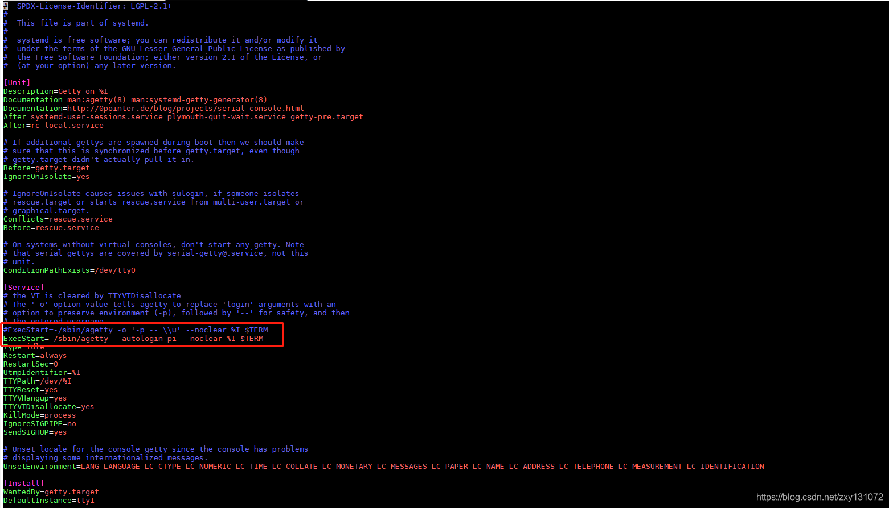
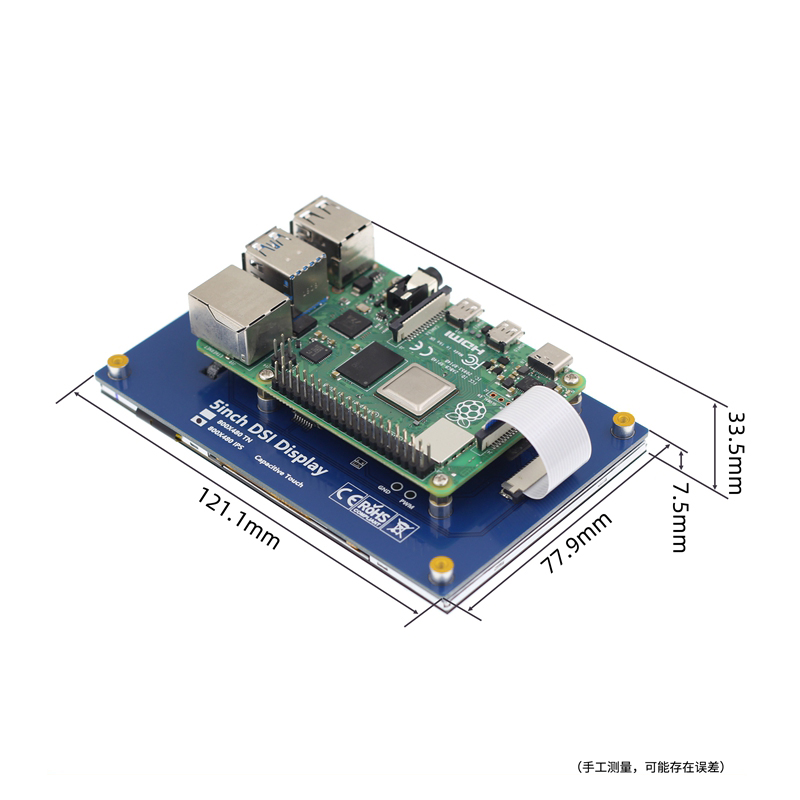
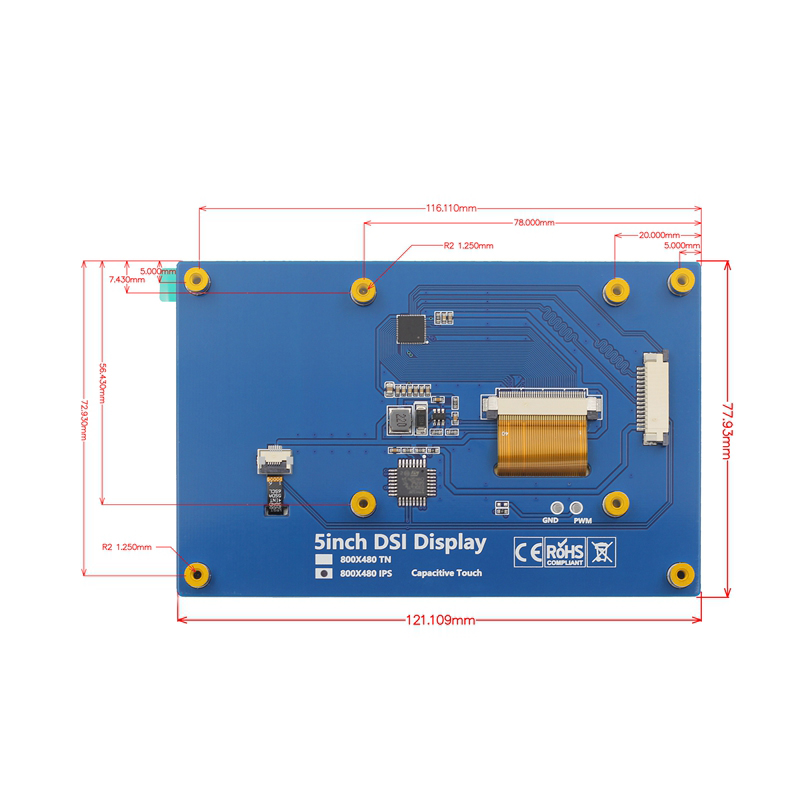
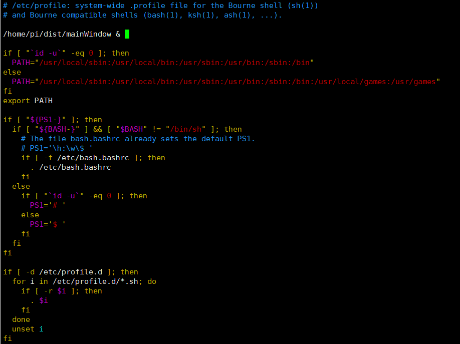

# 一、 设备配件列表

| 名称 | 型号 | 链接 |      |      |      |
| :--: | :--: | :--: | :--: | ---- | ---- |
|      |      |      |      |      |      |
|      |      |      |      |      |      |
|      |      |      |      |      |      |
|      |      |      |      |      |      |
|      |      |      |      |      |      |
|      |      |      |      |      |      |
|      |      |      |      |      |      |
|      |      |      |      |      |      |
|      |      |      |      |      |      |


# 二、软件开发环境

## 1. 开发环境

- 操作系统: win10
- IDE工具: PyCharm
- python版本: 3.8.10
- 数据库: mysql8.0.23


## 2. 运行环境

- 硬件环境: 树莓派4B(8GB)
- 树莓派系统: 2022-04-04-raspios-bullseye-arm64
- python版本: 3.9.3
- 数据库: MariaDB10.5.15

## 3.树莓派引脚


# 三、系统配置

## 1. 树莓派免密码登录

> 修改如下文件，

```bash
sudo  vim /etc/systemd/system/getty.target.wants/getty\@tty1.service
# 找到ExeStart=-/sbin/agetty -o '-p -- \\u' --noclear %I $TERM
# 改成：
ExeStart=-/sbin/agetty --autologin pi --noclear %I $TERM
# 保存后，重启就可以自动以pi用户登录。
# root用户实现开机免密码登陆实际上是和上面的操作一样的，将上面的那一行改为root即可。这个需要根据自己的实际需求来更改。
```



## 2. 配置远程连接

> 在/boot下新建SSH文件，无后缀名或者进入系统后输入sudo raspi-config，选择interface option，选择SSH，选择[YES]

 

## 3.软件源修改

### 3.1 修改raspi.list

```bash
sudo nano /etc/apt/sources.list.d/raspi.list
# 注释掉原来的内容，新增如下内容。清华镜像站好像还没同步Buster版本的系统源，这里用的中科大的
deb http://mirrors.ustc.edu.cn/archive.raspberrypi.org/debian/ buster main ui
```

### 3.2 同步源

```bash
sudo apt-get update
sudo apt-get upgrade
```


## 4. Python配置

### 4.1 安装pip

执行pip3 -V，若提示没有相关命令，则可以执行以下命令来安装pip3

```bash
sudo apt update
sudo apt install python3-venv python3-pip
```


### 4.2 升级pip

将pip3升级到最新版本

```bash
sudo python3 -m pip install --upgrade pip
```


### 4.3 安装yaml库

```python
pip install PyYAML
pip install ruamel.yaml
```


## 5. 安装PYQT5

### 5.1 安装QT

```bash
sudo apt install -y python3-pyqt5
```

### 5.2 安装QT库

```bash
sudo apt install -y python3-pyqt5.qsci python3-pyqt5.qtmultimedia python3-pyqt5.qtopengl python3-pyqt5.qtpositioning python3-pyqt5.qtquick python3-pyqt5.qtsensors python3-pyqt5.qtserialport python3-pyqt5.qtsql python3-pyqt5.qtsvg python3-pyqt5.qtwebchannel python3-pyqt5.qtwebkit python3-pyqt5.qtwebsockets python3-pyqt5.qtx11extras python3-pyqt5.qtxmlpatterns
```


## 6. 安装 openCv库

### 6.1 升级numpy，scipy，matplotlib

```bash
sudo pip3 uninstall numpy
sudo pip3 uninstall scipy
sudo pip3 uninstall matplotlib
sudo pip3 install numpy -i http://pypi.douban.com/simple/
sudo pip3 install scipy -i http://pypi.douban.com/simple/
sudo pip3 install matplotlib -i http://pypi.douban.com/simple/
```

### 6.2 安装opencv-python

```bash
sudo pip3 install opencv-python
# 若上面的库与QT冲突，则安装opencv-python-headless，该库不支持GUI组件，所以imshow()函数和waitkey()等无法使用
sudo pip3 install opencv-python-headless
```

### 6.3 安装libatlas-base-dev

```bash
sudo apt-get install libatlas-base-dev
```


## 7. MySQL安装及配置

### 7.1 安装mysql

树莓派安装mysql时会提示应该安装mysql的替代产品mariadb，所以直接安装mariadb数据库

```bash
sudo apt install mariadb-server
```

### 7.2 配置远程访问

```
sudo nano /etc/mysql/mariadb.conf.d/50-server.cnf
# 找到被注释掉的 port 和没有注释掉的 bind-address，分别对其取消注释和增加注释。保存后重启服务。
# 执行完毕之后重启服务
sudo systemctl restart mariadb
```

### 7.3 配置mariadb-server

```bash
sudo mysql
```

### 7.4 修改root密码

```mysql
set password for 'root'@'localhost'=password('root');
FLUSH PRIVILEGES;
```

### 7.5 创建远程访问账户

```mysql
CREATE user 'pi'@'%' identified by 'pi';
GRANT ALL PRIVILEGES ON *.* TO 'pi'@'%' WITH GRANT OPTION;
FLUSH PRIVILEGES;

CREATE user 'ifir100'@'%' identified by '12345678';
GRANT ALL PRIVILEGES ON *.* TO 'ifir100'@'%' WITH GRANT OPTION;
FLUSH PRIVILEGES;
```

### 7.6 python安装mysql驱动及代码库

python连接mysql需要驱动，执行以下命令安装mysql驱动

```bash
sudo python3 -m pip install mysql-connector
sudo pip install PyMySQL
```


### 7.7 创建数据库

```mysql
create database ifir100;
use ifir100;
SET NAMES utf8mb4;
SET FOREIGN_KEY_CHECKS = 0;
-- ----------------------------
-- Table structure for data
-- ----------------------------
DROP TABLE IF EXISTS `data`;
CREATE TABLE `data`  (
  `id` bigint(20) UNSIGNED NOT NULL AUTO_INCREMENT,
  `number` varchar(30) CHARACTER SET utf8mb4 COLLATE utf8mb4_general_ci NOT NULL,
  `c_line` float NOT NULL,
  `t_line` float NOT NULL,
  `create_time` datetime(0) NOT NULL,
  PRIMARY KEY (`id`) USING BTREE
) ENGINE = InnoDB AUTO_INCREMENT = 4 CHARACTER SET = utf8mb4 COLLATE = utf8mb4_general_ci ROW_FORMAT = Dynamic;

SET FOREIGN_KEY_CHECKS = 1;
```


## 8. 电池模块

### 8.1 安装PiSugar服务

```bash
curl http://cdn.pisugar.com/release/pisugar-power-manager.sh | sudo bash
```
### 8.2 安装Python库

```bash
pip3 install pisugar
```
### 8.3 Python示例代码

```python
# -*- coding: utf-8 -*-
""" 获取电池电量的API """
try:
    from pisugar import *
except Exception as e:
    print("当前系统不支持PiSugar")

    
def getPower():
    try:
        conn, event_conn = connect_tcp('raspberrypi.local')
        server = PiSugarServer(conn, event_conn)
        server.register_single_tap_handler(lambda: print('single'))
        server.register_double_tap_handler(lambda: print('double'))
        level = server.get_battery_level()
        charging = server.get_battery_charging()
        return level, charging
    except Exception:
        return 0, False
    
    
if __name__ == "__main__":
    print(getPower())
```
### 8.4 参考链接

https://github.com/PiSugar/pisugar-power-manager-rs#unix-domain-socket--webscoket--tcp 

https://github.com/PiSugar/pisugar-server-py


## 9. 触摸屏配置





### 1. 显示方向和触摸方向对应关系表

| 显示方向  | FKMS模式设置     |  传统图形模式设置    |  触摸方向设置                                     |
| :-----:     | :----:      | :-----:            | :-----:                                        |
|不旋转     |normal          |display_rotate=0    |Option "CalibrationMatrix" "1 0 0 0 1 0 0 0 1"  |
|顺时针90°  |right           |display_rotate=1    |Option "CalibrationMatrix" "0 1 0 -1 0 1 0 0 1" |
|顺时针180° |inverted        |display_rotate=2    |Option "CalibrationMatrix" "-1 0 1 0 -1 1 0 0 1" |
|顺时针270° |left            |display_rotate=3    |Option "CalibrationMatrix" "0 -1 1 1 0 0 0 0 1" |
| 水平翻转  | 无           |display_rotate=0x10000 | Option "CalibrationMatrix" "-1 0 1 0 1 0 0 0 1"|
|垂直翻转   | 无           | display_rotate=0x20000 |Option "CalibrationMatrix" "1 0 0 0 -1 1 0 0 1" |


### 2. 修改屏幕显示方向

```bash

sudo nano /boot/config.txt
# 注释掉所有的 dtoverlay=vc4-kms-v3d
# 并在[pi4]下添加display_rotate=3
[pi4]
arm_boost=1
# 旋转270度
display_rotate=3
```

### 3. 修改40-libinput.conf

```editorconfig
sudo nano /usr/share/X11/xorg.conf.d/40-libinput.conf
# 在 Identifier "libinput touchscreen catchall" 选项中添加#  Option "CalibrationMatrix" "0 -1 1 1 0 0 0 0 1"

Section "InputClass"
        Identifier "libinput touchscreen catchall"
        MatchIsTouchscreen "on"
        Option "CalibrationMatrix" "0 -1 1 1 0 0 0 0 1"
        MatchDevicePath "/dev/input/event*"
        Driver "libinput"
EndSection
```


# 四、软件打包

##  1. 安装pyinstaller

将python代码打包成可执行文件需要用到pyinstaller

```bash
sudo pip3 install pyinstaller
```


## 2. 使用pyinstaller打包

其中 -F 用于生成单文件。在打包完成后会生成一个build文件夹和一个dist文件夹，

把开发目录中的conf文件夹拷贝到dist目录下即可

```bash
pyinstaller -F mainWindow.py
```


## 3 软件安装

把上述步骤中的dist文件夹拷贝到树莓派/home/pi目录中，修改/etc/profile文件

```bash
sudo nano /etc/profile
```
在文件的开头添加`/home/pi/dist/mainWindow &` 保存并退出




